# Frontend Framework Benchmark

> A data-driven, head-to-head comparison of **7 frontend frameworks** — React, Vue.js, Angular, Leptos, Yew, Dioxus, and Blade.php — each running the **exact same Todo app** on the **same benchmark harness**.
>
> The point of the project is **fairness**: every implementation renders the identical UI, produces identical state, and is measured by the same code path. Visual parity is not assumed — it is asserted pixel by pixel and fails the build when it regresses.

[](https://github.com/ypcipansor/frontend-benchmark/actions/workflows/basic-checks.yml)
[](https://github.com/ypcipansor/frontend-benchmark/actions/workflows/benchmark.yml)
[](https://github.com/ypcipansor/frontend-benchmark/actions/workflows/benchmark-comprehensive.yml)

---

## At a glance

Seven runtimes, one screen. Each tile below is a live capture from that framework's own server — React (JavaScript), Vue (JavaScript), Angular (TypeScript), Leptos / Yew / Dioxus (Rust compiled to WebAssembly), and Blade.php (server-rendered PHP).


*Default view: 100 todos, 67 remaining. The only intentional difference is the framework name in the header badge and the footer.*


## The shared application

All seven implementations build the same Todo app from the same specification:

| Behaviour | Detail |
|-----------|--------|
| Initial data | **100 todos**: `Todo item 1` … `Todo item 100` |
| Completion rule | Every 3rd item is completed — items **3, 6, 9, …, 99** (**33 completed**, **67 remaining**) |
| Filters | **All**, **Active**, **Completed** |
| Interactions | Add, toggle, toggle-all, delete |
| Styling | One shared stylesheet, `shared/styles/todo.css` |
| Page title | Uniform across frameworks |

### Every view captured

The app is a single page with five distinct rendered views. **All five are captured for all seven frameworks — 35 screenshots in total — and every one is shown on this page.**

| View | What it shows | Items rendered |
|------|---------------|---------------:|
| `all` | Default view, no filter | 100 |
| `active` | `Active` filter applied | 67 |
| `completed` | `Completed` filter applied | 33 |
| `input-filled` | Text typed into the input | 100 |
| `empty-state` | Every todo deleted, empty-state panel visible | 0 |

## Visual parity — every framework, every state

This is the heart of the benchmark: the same screen, rendered by seven different runtimes. Every montage below was assembled from live captures and then checked automatically (see [Verifying visual parity](#verifying-visual-parity)): live DOM/geometry/state parity, pixel equality of the saved captures, and a clean console.

### All — 100 todos, 67 remaining


### Active filter — 67 items

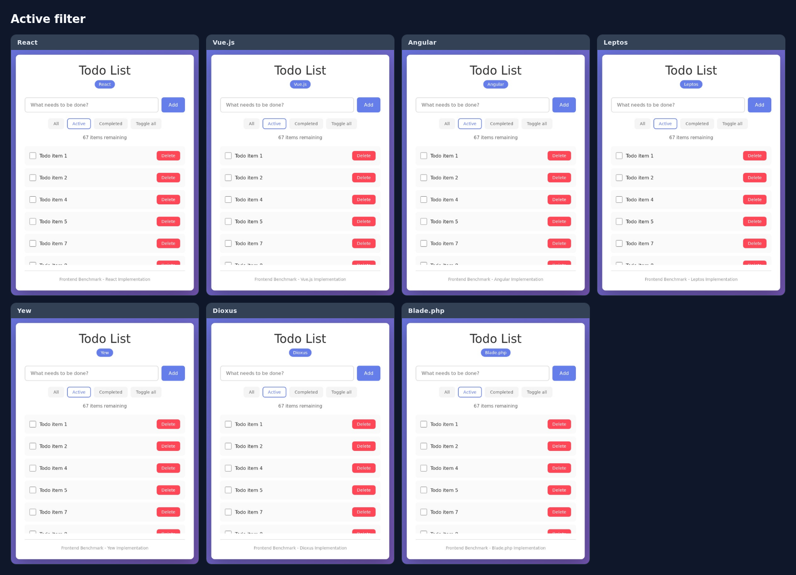

### Completed filter — 33 items


### Input with text entered


### Empty state — after deleting every todo

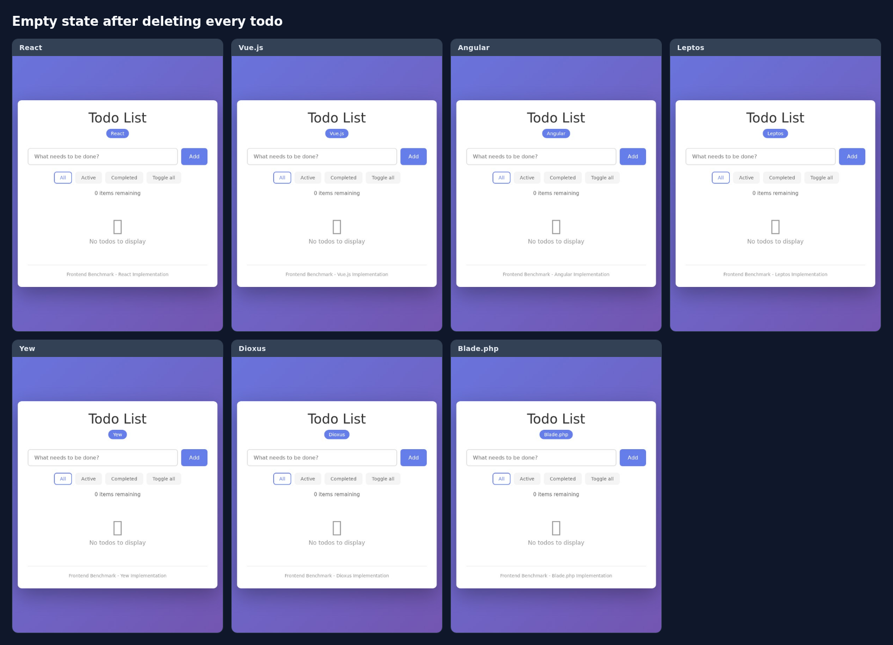

---

## Per-framework screenshots

The complete set of 35 captures, framework by framework. Full-resolution PNGs (1440×1024) live in [`docs/screenshots/`](docs/screenshots/); the images below are the optimized crops from [`docs/images/`](docs/images/).

### ⚛️ React 19 (JavaScript)

| All | Active | Completed | Input | Empty |
|:---:|:---:|:---:|:---:|:---:|
| 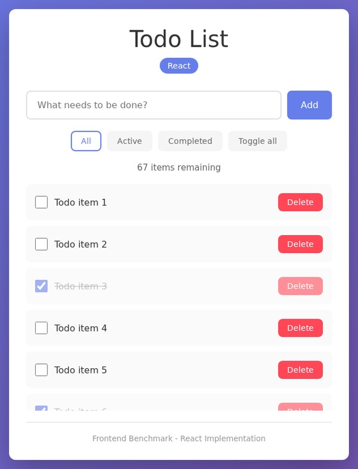 |  | 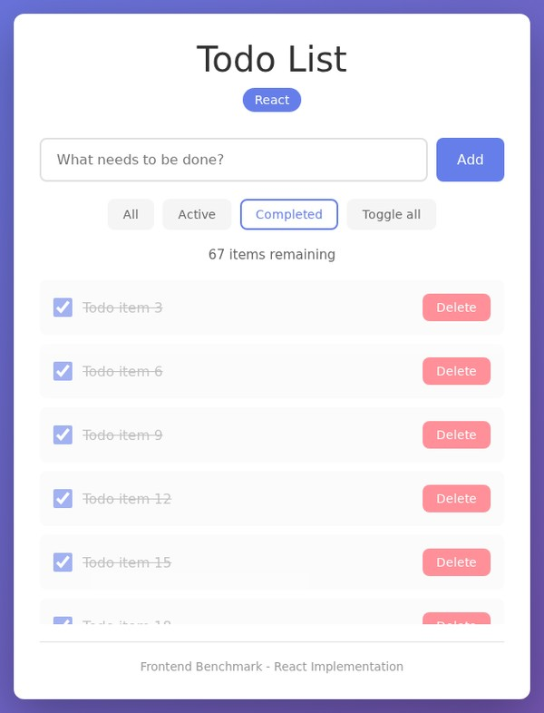 |  |  |

### 🟩 Vue.js 3 (JavaScript)

| All | Active | Completed | Input | Empty |
|:---:|:---:|:---:|:---:|:---:|
|  |  | 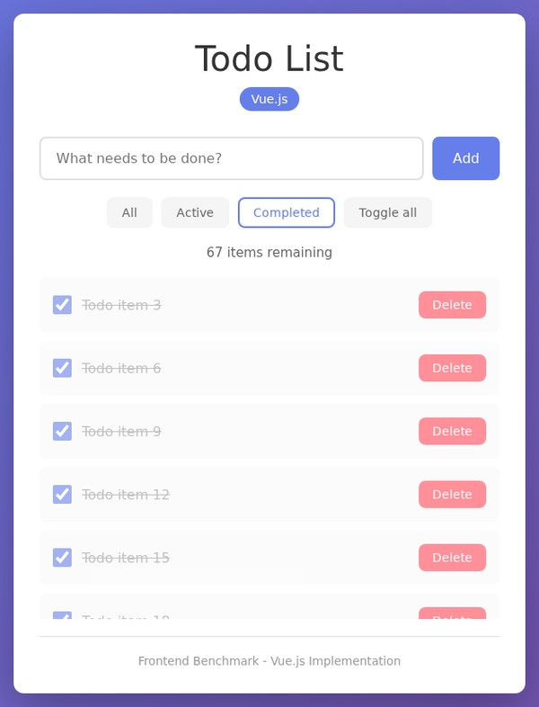 |  | 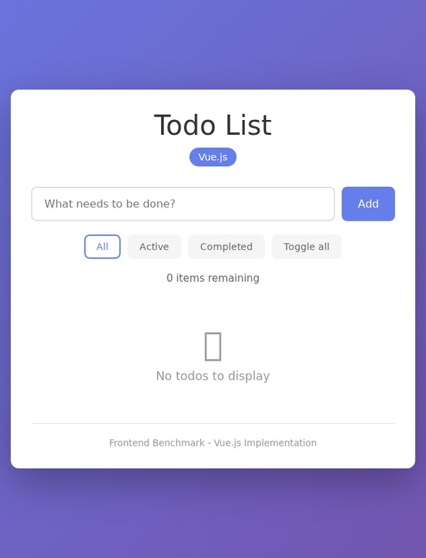 |

### 🅰️ Angular 21 (TypeScript)

| All | Active | Completed | Input | Empty |
|:---:|:---:|:---:|:---:|:---:|
|  |  |  |  |  |

### 🦀 Leptos 0.8 (Rust/WASM)

| All | Active | Completed | Input | Empty |
|:---:|:---:|:---:|:---:|:---:|
|  |  |  | 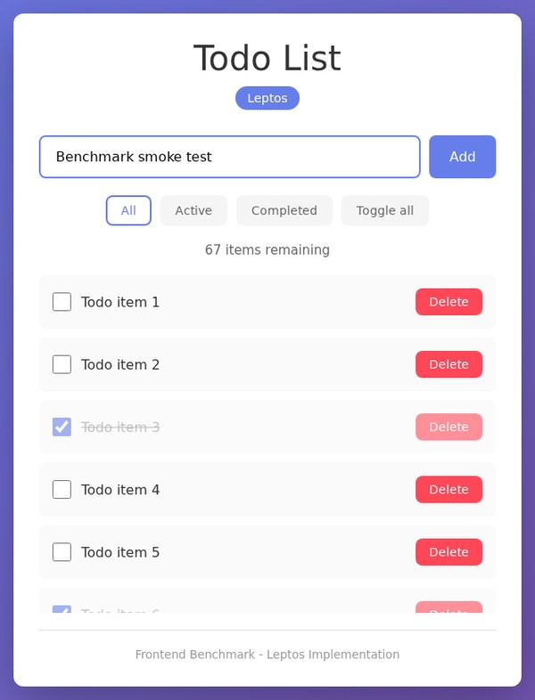 |  |

### 🦀 Yew 0.23 (Rust/WASM)

| All | Active | Completed | Input | Empty |
|:---:|:---:|:---:|:---:|:---:|
|  |  | 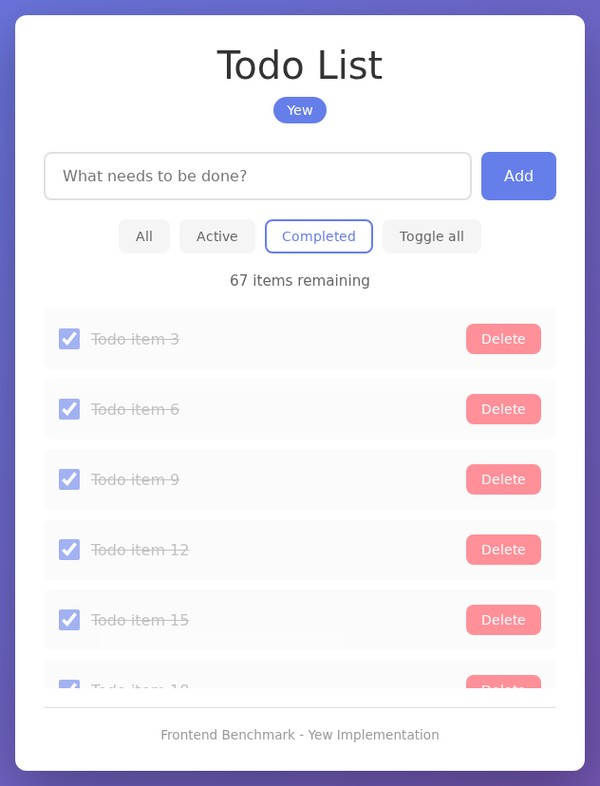 |  | 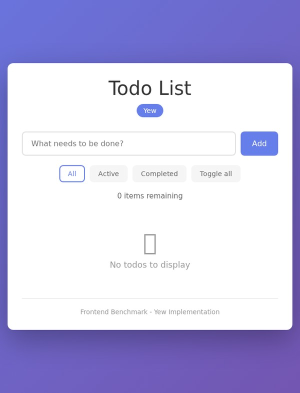 |

### 🦀 Dioxus 0.7 (Rust/WASM)

| All | Active | Completed | Input | Empty |
|:---:|:---:|:---:|:---:|:---:|
| 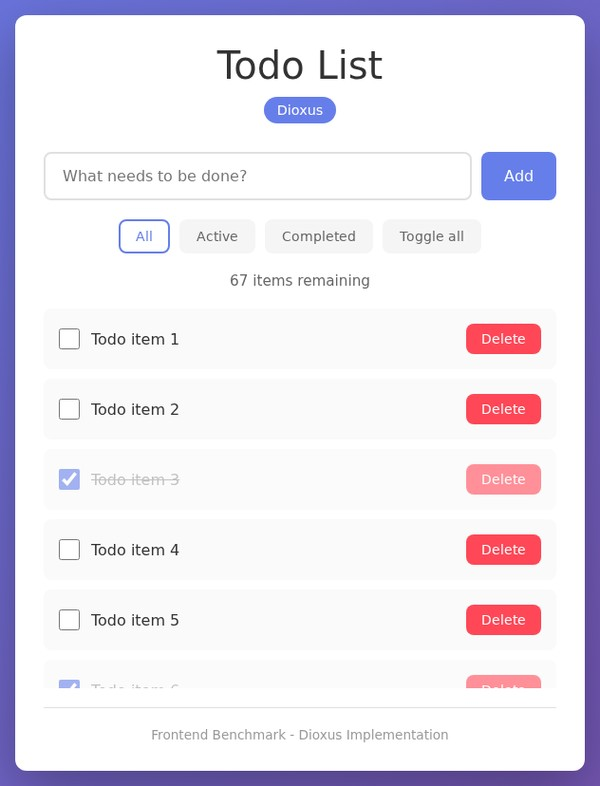 | 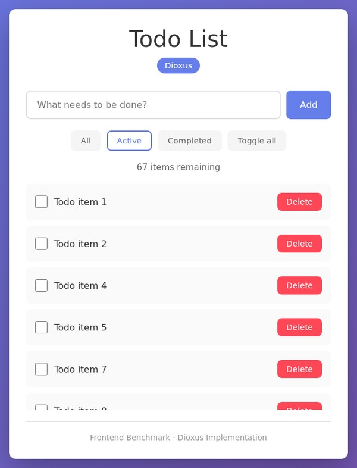 |  |  |  |

### 🐘 Blade.php (PHP)

| All | Active | Completed | Input | Empty |
|:---:|:---:|:---:|:---:|:---:|
|  | 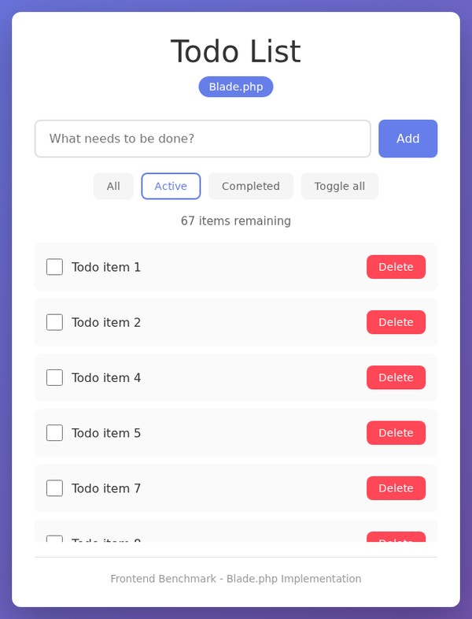 |  | 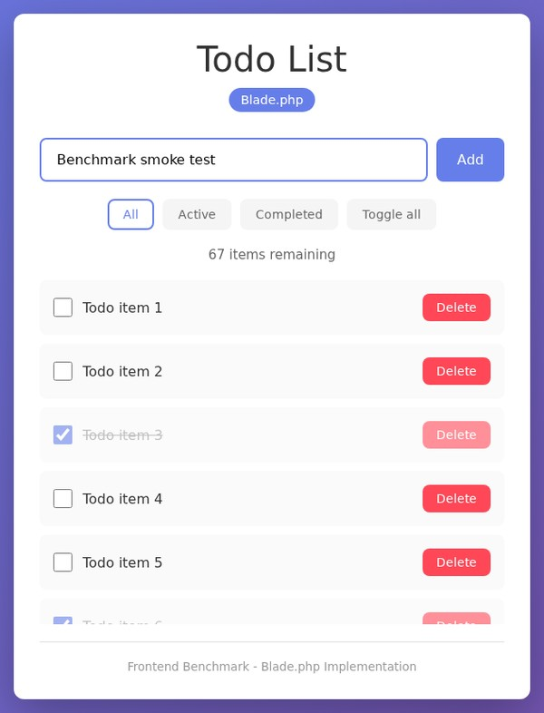 |  |

---

## Benchmark Results

*Last updated: 2026-09-16*

> ⚠️ **Provenance:** Values below were collected across separate runs and environments and may not be directly comparable. A single, fresh, full 7-framework run in one environment is needed before rankings can be treated as authoritative.

### Quick Highlights

- 🚀 **Top Lighthouse score:** Vue — **100/100**
- 📦 **Smallest gzipped bundle:** blade — **1.29 KB**
- ⚡ **Highest throughput:** Dioxus — **38,050 req/s** @ 2,000 connections

- Top throughput (top 3): Dioxus (38,050 req/s), Vue (32,903 req/s), Leptos (32,434 req/s)
- Top Lighthouse (top 3): Vue (100/100), Leptos (100/100), Angular (100/100)
- Smallest bundles (top 3): blade (1.29 KB), vue (24.94 KB), react (58.32 KB)

---

### Lighthouse Performance

| Rank | Framework | Perf | FCP | LCP | TTI |
|-----:|-----------|-----:|----:|----:|----:|
| 1 | vue | **100/100** | 1053ms | 1204ms | 1179ms |
| 2 | leptos | **100/100** | 906ms | 1582ms | 1244ms |
| 3 | angular | **100/100** | 1212ms | 1589ms | 1394ms |
| 4 | yew | **100/100** | 903ms | 1579ms | 1612ms |
| 5 | react | **100/100** | 1203ms | 1354ms | 1203ms |
| 6 | dioxus | **98/100** | 1205ms | 2408ms | 2450ms |
| 7 | blade | **87/100** | 751ms | 751ms | 751ms |

### Bundle Sizes (gzipped)

| Rank | Framework | Bundle (gzipped) | Total Size |
|-----:|-----------|------------------:|-----------:|
| 1 | blade | 1.29 KB | 8.95 KB |
| 2 | vue | 24.94 KB | 68.3 KB |
| 3 | react | 58.32 KB | 191.81 KB |
| 4 | angular | 61.31 KB | 187.37 KB |
| 5 | yew | 75.57 KB | 268.4 KB |
| 6 | leptos | 76.1 KB | 375.35 KB |
| 7 | dioxus | 192.3 KB | 522.39 KB |

### Throughput

| Rank | Framework | Peak Avg Req/s | p50 | p90 | p99 | Errors |
|-----:|-----------|---------------:|----:|----:|----:|------:|
| 1 | **Dioxus** | 38,050 | 100ms | 116ms | 148ms | 0 |
| 2 | **Vue** | 32,903 | 201ms | 380ms | 3887ms | 664 |
| 3 | **Leptos** | 32,434 | 214ms | 403ms | 3893ms | 486 |
| 4 | **Angular** | 30,423 | 202ms | 284ms | 3914ms | 487 |
| 5 | **Yew** | 30,126 | 211ms | 412ms | 3902ms | 443 |
| 6 | **React** | 17,895 | 196ms | 295ms | 3892ms | 476 |
| 7 | **Blade** | 303 | 2002ms | 2016ms | 7923ms | 13,600 |

### Stress Test Summary

| Rank | Framework | Peak Avg Req/s | Peak Concurrency | p50 | p90 | p99 | Errors | Non-2xx |
|-----:|-----------|---------------:|----------------:|----:|----:|----:|------:|-------:|
| 1 | dioxus | 38,050 | 2,000 | 100ms | 116ms | 148ms | 0 | 0 |
| 2 | vue | 32,903 | 2,000 | 201ms | 380ms | 3887ms | 664 | 0 |
| 3 | leptos | 32,434 | 2,000 | 214ms | 403ms | 3893ms | 486 | 0 |
| 4 | angular | 30,423 | 2,000 | 202ms | 284ms | 3914ms | 487 | 0 |
| 5 | yew | 30,126 | 2,000 | 211ms | 412ms | 3902ms | 443 | 0 |
| 6 | react | 17,895 | 2,000 | 196ms | 295ms | 3892ms | 476 | 0 |
| 7 | blade | 303 | 2,000 | 2002ms | 2016ms | 7923ms | 13,600 | 0 |

### Runtime Resource Usage

| Framework | CPU (avg / max) | Memory (avg / max) |
|-----------|----------------:|-------------------:|
| vue | 1.80% / 5.20% | 58.60 MB / 75.20 MB |
| react | 2.50% / 8.30% | 65.20 MB / 89.50 MB |
| leptos | 2.80% / 7.50% | 35.20 MB / 48.50 MB |
| yew | 3.20% / 9.10% | 42.80 MB / 55.30 MB |
| angular | 4.20% / 12.50% | 78.40 MB / 102.30 MB |
| blade | 5.50% / 15.80% | 52.30 MB / 68.50 MB |
| dioxus | 62.82% / 162.92% | 6.89 MB / 11.20 MB |

---

### Testing Methodology

All tests were performed using the included `benchmarks/scripts` runner and are reproducible with the Docker-based setup. Results will vary by environment.

For detailed per-framework analysis and complete methodology, see [BENCHMARK_GUIDE.md](BENCHMARK_GUIDE.md).


## Verifying visual parity

The screenshots above are not hand-picked — they are produced and validated by tooling in [`docs/`](docs/). Nothing on this page is committed until the checks pass.

```bash
cd docs
npm ci                      # Playwright + pngjs, from the committed lockfile
npx playwright install chromium
python3 -m pip install -r requirements.txt   # NumPy + Pillow

bash scripts/start-servers.sh   # all seven dev servers on their fixed ports
npm run capture             # 1. capture all 35 screenshots (fails non-zero on any error)
npm run verify              # 2. reject blank / white / mis-sized / incomplete captures
npm run parity              # 3. assert identical DOM, geometry and interaction state (live)
npm run pixel               # 4. diff every state against the React reference
npm run optimize            # 5. card-cropped JPEGs for this README
npm run montage             # 6. side-by-side comparison montages
npm test                    # 7. regression tests for the tooling's failure modes
bash scripts/stop-servers.sh
```

`parity` and `pixel` are separate gates: `parity` drives the live servers and
compares DOM, geometry and state; `pixel` compares the saved captures. The
pipeline runs `capture → verify → parity → pixel → optimize → montage`.

The code guarantees fairness in five independent ways:

| Check | What it enforces |
|-------|------------------|
| **Geometry** | The card is **600px wide at x=420** in all seven frameworks; header, input, filters, list and footer rectangles match to the pixel |
| **Content** | The same 100 items, the same first/last labels, the same 33 checked boxes |
| **State** | `Active` → 67 items, `Completed` → 33 items, add → 101, delete → 100, and the "items remaining" counter matches |
| **Pixels** | Every state of every framework is diffed against the reference capture; differences are only tolerated inside the two framework-name regions, and the masks come from live element geometry — not hardcoded coordinates |
| **Health** | No console errors or uncaught exceptions, and no blank or near-uniform screenshots |

Each script exits non-zero on any deviation, so the whole pipeline is safe to use as a CI gate.

### Parity fixes applied

Making seven runtimes agree required real corrections — every one of them verified by the checks above:

1. **Completion index.** The JS frameworks started at a 0-based index (`i % 3 === 0`), completing item 1, while the Rust and PHP implementations used a 1-based index, completing item 3. The JS implementations were changed to `(i + 1) % 3 === 0`, so every framework now completes items 3, 6, …, 99 and reports **67 remaining**.
2. **Mount-point layout.** React (`#root`), Vue (`#app`), Angular (`app-root`) and Dioxus (`#main`) render into a wrapper element, while Blade writes `.todo-app` straight into `<body>`. The wrappers made the card collapse to **389px** and be centred differently. Neutralizing them with `display: contents` in `shared/styles/todo.css` makes the card the single flex child everywhere.
3. **Blade markup.** Blade emitted a `<div>` inside `<ul>`; it now renders `<li class="todo-item">` like every other framework, and the client-side `render()` targets the same container.
4. **Titles.** Page titles were normalized to `Todo List - <Framework>`.
5. **Subpixel stats shaping.** Vue, Angular and Dioxus merged the remaining-count digits and suffix into a single text node, while React, Leptos, Yew and Blade emitted the digits as their own node. The different text-node segmentation changed subpixel glyph shaping by a fraction of a pixel — invisible to the eye, but a real pixel diff. All seven now wrap the count in its own `<span>`, so `.todo-stats` is byte-identical everywhere.

## Getting started

### Prerequisites

| Tool | Needed for |
|------|-----------|
| Node.js 18+ | React, Vue, Angular |
| Rust 1.70+ and `trunk` | Leptos, Yew, Dioxus |
| `wasm32-unknown-unknown` target | Leptos, Yew, Dioxus |
| PHP 8.2+ and Composer | Blade.php |
| Docker (optional) | Reproducible containerised benchmarks |
| Chrome / Chromium | Lighthouse audits and the screenshot tooling |

### Run an implementation

Each framework lives in `implementations/<framework>/` with its own README.

```bash
# JavaScript / TypeScript
cd implementations/react   && npm install && npm run dev     # http://localhost:5173
cd implementations/vue     && npm install && npm run dev
cd implementations/angular && npm install && npm start

# Rust / WebAssembly (needs: cargo install trunk && rustup target add wasm32-unknown-unknown)
cd implementations/leptos && trunk serve
cd implementations/yew    && trunk serve
cd implementations/dioxus && trunk serve

# PHP
cd implementations/blade  && composer install && php -S 127.0.0.1:8000 -t .
```

### Run the benchmarks

```bash
cd benchmarks/scripts
npm install

npm run benchmark:docker        # quick pass: JS frameworks only (~30 min)
npm run benchmark:docker:full   # all 7 frameworks + CPU/RAM + Lighthouse (~2 hours)
npm run benchmark:stress        # sustained load, latency percentiles
npm run update-readme           # write fresh results into the Benchmark Results section
```

Docker is recommended for consistent, isolated numbers — see [DOCKER.md](DOCKER.md) and [QUICKSTART_DOCKER.md](QUICKSTART_DOCKER.md).

## What this benchmark measures

Each framework is driven through the same automated suite, ideally inside isolated Docker containers:

- 🚀 **Lighthouse performance** — FCP, LCP, TTI under simulated throttling
- ⚡ **Throughput** — peak requests/sec with p50 / p90 / p99 latency
- 🧨 **Stress test** — sustained load up to 2,000 concurrent connections
- 📦 **Bundle size** — raw and gzipped JS / CSS / WASM / HTML
- 💻 **CPU usage** — average and peak during runtime
- 💾 **Memory usage** — average and peak during runtime
- ⏱️ **Build time**

Full methodology is in [BENCHMARK_SPEC.md](BENCHMARK_SPEC.md) and [BENCHMARK_GUIDE.md](BENCHMARK_GUIDE.md).

## Project structure

```
frontend-benchmark/
├── implementations/          # React, Vue, Angular, Leptos, Yew, Dioxus, Blade
├── benchmarks/
│   ├── scripts/              # Lighthouse, stress, bundle-size and README automation
│   ├── results/              # Raw result JSON (gitignored; kept as a CI artifact)
│   └── tools/                # Custom measurement tools
├── shared/styles/todo.css    # The single shared stylesheet
├── docs/
│   ├── screenshot.js         # Playwright capture (all five UI states)
│   ├── parity-check.js       # Cross-framework DOM/geometry/state assertions
│   ├── verify-screenshots.js # Rejects blank, white or mis-sized captures
│   ├── pixel-parity.py       # Pixel diff vs the reference, masking name regions
│   ├── optimize-images.py    # Card-cropped JPEGs for this README
│   ├── build-montage.js      # Side-by-side comparison montages
│   ├── screenshots/          # Full-resolution PNGs (35 files)
│   └── images/               # Optimized images used on this page
├── .github/workflows/        # CI plus the weekly comprehensive benchmark
└── BENCHMARK_SPEC.md         # Implementation and measurement specification
```

## Automated refreshing

The **Comprehensive Benchmark** workflow runs **every Monday at 00:00 UTC** and can be triggered manually. It:

1. Builds and serves all 7 frameworks in Docker
2. Runs Lighthouse, CPU/RAM sampling and bundle-size analysis
3. Runs stress tests up to 2,000 concurrent connections
4. Merges the measurements and regenerates the **Benchmark Results** section of this README
5. Opens a PR that updates only `README.md`

Raw JSON under `benchmarks/results/` is **not committed**. Each run regenerates `comprehensive-benchmark-results.json`, uploads it as a workflow artifact retained for **90 days**, and the tables above remain the durable record. Re-run the full benchmark to refresh them.

## Documentation

| Document | Purpose |
|----------|---------|
| [docs/README.md](docs/README.md) | The screenshot & parity tooling, end to end |
| [BENCHMARK_SPEC.md](BENCHMARK_SPEC.md) | The Todo app specification and every metric definition |
| [BENCHMARK_GUIDE.md](BENCHMARK_GUIDE.md) | End-to-end guide to running the full suite |
| [COMPREHENSIVE_BENCHMARK_README.md](COMPREHENSIVE_BENCHMARK_README.md) | Quick reference for the comprehensive runner |
| [DOCKER.md](DOCKER.md) | Containerised benchmarking |
| [QUICKSTART_DOCKER.md](QUICKSTART_DOCKER.md) | Docker quick start |
| [CI_CD_GUIDE.md](CI_CD_GUIDE.md) | GitHub Actions workflows |
| [GITHUB_ACTIONS_SUMMARY.md](GITHUB_ACTIONS_SUMMARY.md) | What the CI work covered |
| [RESULTS_TEMPLATE.md](RESULTS_TEMPLATE.md) | Shape of the benchmark result JSON |
| [CONTRIBUTING.md](CONTRIBUTING.md) | How to add or improve an implementation |

## Contributing

Contributions are welcome. Read [BENCHMARK_SPEC.md](BENCHMARK_SPEC.md) for implementation guidelines and [CONTRIBUTING.md](CONTRIBUTING.md) for the process. Any new implementation must pass `docs/parity-check.js`, `docs/pixel-parity.py` and `docs/verify-screenshots.js` before it is merged.

## License

MIT — see [LICENSE](LICENSE).
